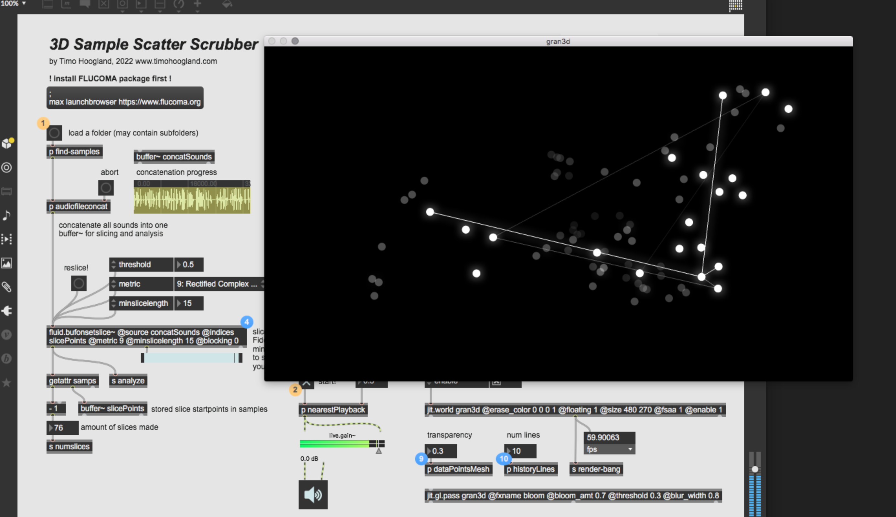

# 🎆 Sample Scatter Scrubber

Plot and scrub through a set of samples in 3D space organized based on their spectral description

# 📖 About 

With this patch you can load a bunch of soundfiles from your harddrive and combine them into one long buffer~ with `fluid.bufcompose~`. Then slice them up into short sections with `fluid.bufonsetslice~`. Analyze every slice for there spectral content with `fluid.bufmfcc~` and `fluid.bufstats~` and get some statistics from it. Translate that big dataset into a 3-dimensional display with dimensionality reduction via `fluid.umap~` allowing you to use your camera to find the nearest points in space. Randomly play the nearest points in a granular way. Select multiple points by creating a large neighbourhood to find for the `fluid.kdtree~`. 

# 💻 Install 

1. 🤓 Install the amazing [**Flucoma Package**](https://www.flucoma.org/download/)
2. 👾 Download or clone this repository
3. 🚀 Start Max8 and open `sample-scatter-scrubber.maxpat`

# 🙏 Thanks

With big thanks to the Flucoma team for making this amazing package!